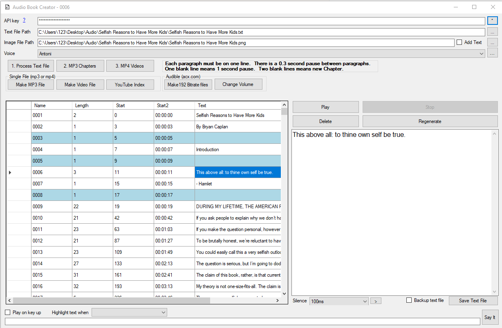

# ElevenLabs Audio Book Creator

This Windows Desktop application will create an mp3/mp4 files from a text file. These files can then be uploaded to YouTube or Audible.

Originally posted here:
<https://www.codeproject.com/Articles/5361335/Audio-Book-Creator/>

## Introduction
This application lets you create an audio book using Eleven Labs API. Eleven Labs API allows only 5,000 characters per request. The application will generate mp3 file for each paragraph and then merge them together.

If you have a pdf file, the text file needs to be generated by opening the pdf file in Word and copied and pasted to a text file. Open the text file in a text editor that has line numbers such as Notepad2. Open the file in and remove text that would not be read like: table of contents, footnotes, index and references. Each paragraph must be on one line. 

There is a 0.3 second pause between paragraphs. One blank line means 1 second pause. Two blank lines means new Chapter.

One blank line means 1 second pause. But you can use the “Silence” feature to customize the pause duration.

## How to Create an Audiobook
- First get API Key from Eleven Labs (https://beta.elevenlabs.io/pricing)
- Select Eleven Labs “Voice”. A custom voice can be created and used.
- “Say it” will generate mp3 file based on any text and place the file into Temp folder in the same folder and the EXE.
- “Highlight text when” option helps you with text file correction and editing before to generate the mp3 files. For example, “Begins with lower case character” and “Begins with a number” option will highlight paragraphs that might be broken during Word PDF conversion. “Contains number” might help identify paragraphs that contain a footnote number.
- “Save text file” saved the changes in the text file. “Backup text file” option creates a backup to let you undo the changes you made to the text file. The backup text files will be placed in the folder with the same name as the text file name plus “_backup”.
- “1. Process Text File” will generate MP3 file for each line in the text file. This might cost you about $50 depending on the size of the file. (The current price is $99 per 0.5 MB. An average book is about 0.25 MB.) The file will be placed in the folder with the same name as the text file name. Each file will be named after the line number in the text file like 0001.mp3. This means that you should not add or delete lines to the text file after MP3 files are generated.
- Select a line in the grid and click “Play” to play an MP3 file. Click to “Stop” to stop the mp3 file playing. Select a line in the grid and click “Delete” to delete an MP3 file.
- You can delete bad mp3 files and click “1. Process Text File” again to regenerate the mp3 files that were deleted.
- You can also select a line in the grid and click “Regenerate” to re-create the MP3 file. This option will also save the text file if needed.
- “Play on key up” option allows you to listen to the entire book by pressing the arrow down key after selecting a line text.
- Once you are satisfied with the quality of the generated mp3 files, click “2. MP3 Chapters” to generate mp3 file for each chapter. Two blank lines in the text file means new Chapter. The files will be placed in the folder with the same name as the text file name plus “-Chapters”.
- Merge MP3 Chapter files into one mp3 file. The mp3 file will be placed in the folder as the text file and have the same name but with mp3 extension.

## Uploading Audiobook to YouTube
- First select Image file to be used for mp4 file generation.
- “3. Make MP4 Files” will generate mp4 file for each chapter. This operation uses mp3 files from “-Chapters” folder. This operation can take about 8 hours. These files can then be uploaded to YouTube. The files will be placed in the folder with the same name as the text file name plus -Videos
- “Make Video File” will generate one mp4 file. These files can then be uploaded to YouTube. The file will be generated by merging MP4 chapter files if they are available. MP4 chapter files are not available. The single mp3 file will be used, but the operation can take about 8 hours. The MP4 file will be placed in the folder as the text file and have the same name but with mp4 extension.
- Generate YouTube index from Chapters mp3 file duration. The index can be used in the Video description or the comment section. Note that MP4 files night be generated with a different duration so the Index might need to be adjusted.

Here is an audiobook I created using this app.
<https://www.youtube.com/watch?v=O2ZSmuwmp8A/>

Uploading Audiobook to Audible (acx.com)
- Audible requires MP3 file with 192 bitrate. “Make 192 Bitrate files” operation uses mp3 files from “-Chapters” folder. The mp3 192 bitrate files will be placed in the folder with the same name as the text file name plus “-Chapters192”.
- Audible (acx.com) sometimes requires the mp3 file values to be increased or decreased. “Change Volume” option allows you to do that. If ACX still complains, try using Audacity.

Using the Code
Code is using ffmpeg.exe to convert mp3 to mp4 and change mp3 bitrate. 
